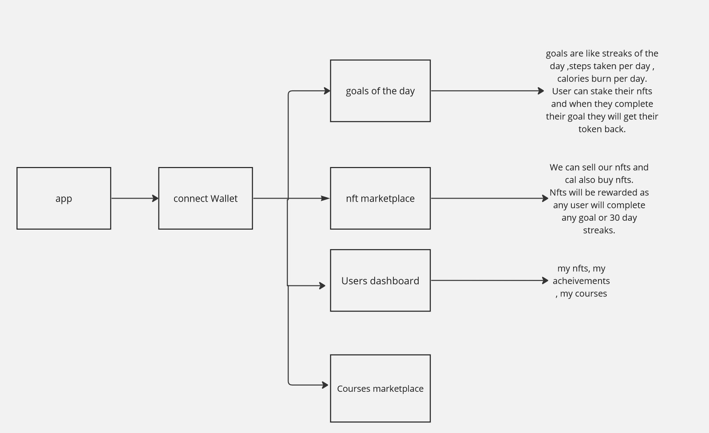

### Project Title

SweatSync: Empowering Fitness Achievements through Token Rewards and Community Engagement

### Team Name

CryptoCrafters

### Project abstract

SweatSync is a groundbreaking fitness management platform that incentivizes users to achieve their fitness goals through a token reward system, monthly streaks, and community-driven features. Users can also access personalized workout plans created by fitness trainers, share their fitness journey on a social-media-like platform, and earn rare NFTs for completing specific tasks. For those seeking additional motivation, a staking mechanism allows users to stake tokens or NFTs, transferring them upon successful goal completion.

### Project breakdown

SweatSync aims to revolutionize the fitness industry by combining innovative features to motivate and engage users. The platform offers:

_Token Reward System_

Users earn tokens upon achieving fitness goals and maintaining monthly streaks. These tokens can be used for various rewards within the platform.

_Trainer Marketplace_

Fitness trainers can create and sell personalized workout plans on the platform. This not only provides a revenue stream for trainers but also offers users diverse and expert-curated fitness routines.

_Community-Driven Platform_

Users can share their fitness goals, achievements, and progress with the SweatSync community. This creates a supportive environment where users can motivate each other, fostering a sense of camaraderie.

_NFT Incentives_

Rare NFTs are awarded to users upon completing specific fitness tasks. These NFTs can be collected, traded, or even used to unlock exclusive content within the platform.

_Staking Mechanism:_

For users who struggle with consistency, a staking feature allows them to commit tokens or NFTs. Upon achieving their fitness goals, the staked tokens or NFTs are transferred back to the user along with the earned rewards.

### Technology Stack

- Solidity
- Next.js
- Polygon blockchain
- IPFS for decentralized storage
- Hardhat

### Work Flow Diagram

_Goal Achievement_

1. User sets a fitness goal.
2. Platform tracks progress and achievements.
3. Tokens are awarded upon goal completion.

_Trainer Marketplace:_

1. Trainers create workout plans.
2. Users purchase plans using platform tokens.
3. Completed plans contribute to users' achievements.

_Community Engagement:_

1. Users share goals and achievements.
2. Community interactions contribute to a positive and supportive environment.

_NFT Incentives:_

1. Specific fitness tasks trigger NFT rewards.
2. Users collect and showcase their earned NFTs.

_Staking Mechanism:_

1. Users stake tokens or NFTs.
2. Successful goal completion results in the return of staked assets.

### Milestone Breakdown

1. **_Project Kick-off (Days 1)_:** _Work on the project workflow and smart contract development_.
2. **_Design Phase (Days 2-3)_:** _smart contractdevelopment_.
3. **_Development Sprint (Days 3-4)_:** _Finalize design concepts and create UI_.
4. **_Development Sprint (Days 5-6)_:** _Implement core functionalities_.

# Team Details section

### Teammates

- Kritika Joshi ([GitHub Profile](https://github.com/KritikaJoshi22))
- Nandani Jaiswal ([GitHub Profile](https://github.com/Yeagerist-Nandini))
- Yogendra Singh Diwan ([GitHub Profile](https://github.com/thhorr))
- Akshat ([GitHub Profile](https://github.com/Akshat-Somvanshi))

### Individual Contribution Breakdown

- Kritika Joshi: Smart Contract Development
- Yogendra Singh Diwan: Smart Contract Development
- Nandani Jaiswal: Frontend Development
- Akshat: Frontend Development

# Future Prospects and Conclusion

_Potential Future Features or Enhancements:_

1. Integration of apis which can track steps taken or calories burn(We are making the app in react.js so it's currently not possible for us).
2. Integration of a fitness tips bot.
3. Making the dapp crosschain.
4. Integration of additional gamification elements to further engage users.

_Scaling Strategies:_

1. Implementing load balancing and optimizing database queries to handle increased user activity.
2. Exploring decentralized technologies for enhanced scalability and user data security.
3. Implement ZK-rollups to increase the scalability and reduce the gas fee.

_One-line Summary:_
SweatSync transforms fitness journeys by incentivizing users through a token reward system, NFT incentives, and a vibrant community-driven platform, fostering a healthier and more engaged user community.
